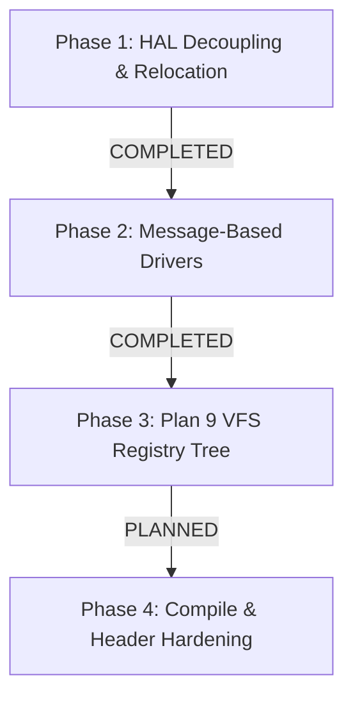

# Refactor Plan: OS1 Microkernel Evolution (GPLv2 Open-Source)

This refactoring plan aligns the **OS1 Microkernel** with standard open-source principles (GPLv2, matching Linux), records all reference inspirations and their direct file locations in the codebase, and blueprints the modular evolution of the microkernel phase by phase.

---

## ⚖️ License & Open-Source Alignment
OS1 is licensed under the **GNU General Public License, Version 2 (GPLv2)**. This licensing choice ensures full alignment with the open-source spirit of **Linux**, promoting collaborative, transparent, and robust operating system development.

### 🌟 Architectural Reference & Inspirations
The dual-architecture microkernel of OS1 is developed by combining proven patterns from established historical operating systems. Plan 9 and seL4 represent our core pillars of design, followed by Linux and BSD models. Below is the prioritizing of our inspirations:

1.  **Plan 9 from Bell Labs (Primary Pillars)**:
    *   *Inspiration*: "Everything is a file/resource" philosophy, hierarchical dynamically mounted key-value trees, and native ring buffers for IPC synchronization.
    *   *File/Code Reference*: The hierarchical dynamic registry keys and ring-buffer serialization mapped in [registry.c](kernel/libkernel/src/registry.c). Plan 9 style system call wrappers (`rfork`, `pread`, `pwrite`, `await`) planned in user libraries.
2.  **seL4 (Secure Embedded L4 - Primary Pillars)**:
    *   *Inspiration*: Strictly thinned Hardware Abstraction Layer (HAL) focused solely on assembly context setups, exception routing, and MMU directory table loads.
    *   *File/Code Reference*: Assembly entry boundaries in [exception.S](kernel/hal/arch/aarch64/cpu/exception.S) (AArch64) and [start.S](kernel/hal/arch/amd64/boot/start.S) (AMD64), context state mapping in `pt_regs`.
3.  **Linux (Kernel)**:
    *   *Inspiration*: Intrusive circular double-linked list structures, K&R style code conventions, and robust Ext4 file traversal logic.
    *   *File/Code Reference*: Double-linked list utility in [list.h](kernel/core/include/core/list.h), storage block parsing in [ext4.c](kernel/core/src/fs/ext4.c) and partition structures in [gpt.c](kernel/core/src/fs/gpt.c).
4.  **base-nexs Project**:
    *   *Inspiration*: Unified system service mapping paradigms and registry loop protocols.
    *   *File/Code Reference*: Architecture registry logic under [registry.c](kernel/libkernel/src/registry.c) and dynamic service coordination.
5.  **BSD / FreeBSD (VFS Layer)**:
    *   *Inspiration*: BSD-style Virtual File System (VFS) mounting mechanism, file node (vnode) virtualization, and path lookup utilities (`namei`, `nameidata`).
    *   *File/Code Reference*: Mount and vnode interface representations planned under resident filesystem management ([vfs.h](kernel/core/include/core/vfs.h)).
6.  **Mach4 (Mach Microkernel)**:
    *   *Inspiration*: Fully isolated helper servers communicating with the core through port-based IPC pipelines and asynchronous scheduling.
    *   *File/Code Reference*: IPC dispatch and IPC registry message queues (`SYS_REG_IPC_SEND`/`SYS_REG_IPC_RECV`) implemented under [syscall.c](kernel/core/src/syscall.c).
7.  **Font Rasterization Libraries (stb_truetype & stb_easy_font)**:
    *   *Inspiration*: Standalone, header-only lightweight graphics typography engine by Sean Barrett.
    *   *File/Code Reference*: TTF parsing tools in [stb_truetype.h](tools/stb_truetype.h) and user fonts output in [stb_easy_font.h](user/sys/include/stb_easy_font.h).
8.  **Limine Bootloader**:
    *   *Inspiration*: Bootloader stage configurations and boot tags passing, ELF segments unpacking boundaries.
    *   *File/Code Reference*: Multi-stage assembly setups and stage loaders inside [kernel/hal/boot/](kernel/hal/boot/).

---

## 📅 Refactoring Plan: Phase by Phase



### 🟢 Phase 1: HAL Decoupling, Relocation, and Thinning
*   **Status**: `[x] COMPLETED`
*   **Goal**: Establish a strictly minimal HAL, relocating hardware-specific setup and boot assembly out of the repository root, and removing redundant duplication.
*   **Key Operations**:
    1.  Relocated startup stage loaders to [kernel/hal/boot/](kernel/hal/boot/).
    2.  Relocated user system startups and platform boundaries to [kernel/hal/user/](kernel/hal/user/).
    3.  Removed untracked duplicate assembly file `user/sys/lib/syscall.S`.
    4.  Thinned `kernel/hal/arch/` of general paging calculations and unified memory mappings, centralizing them in [kernel/core/src/](kernel/core/src/).

### 🟢 Phase 2: Driver Decoupling & Message-Based MMIO/PCI Abstraction
*   **Status**: `[x] COMPLETED`
*   **Goal**: Decouple hardware drivers in [kernel/hal/drivers/](kernel/hal/drivers/) from direct kernel-space function imports. Group drivers under explicit connection buses, interfacing them via message-based control blocks.
*   **Key Operations**:
    1.  **Structural Grouping**: Relocated drivers to physical subfolders `mmio/` and `pci/` under [kernel/hal/drivers/](kernel/hal/drivers/) based on interface type.
    2.  **Message-Based Interfaces**: Implemented `struct hw_driver` messaging protocol and dispatch queues in [drivers.h](kernel/core/include/core/drivers.h) and [drivers.c](kernel/core/src/drivers.c).
    3.  **Driver Port Refactoring**: Shifted UART (PL011/16550) and VirtIO-Block to register under the message dispatcher, resolving driver access through port-based IPC message queues rather than direct C function binding.

### 🟡 Phase 3: Plan 9 + seL4 Style Hierarchical VFS Registry Integration
*   **Status**: `[ ] PLANNED`
*   **Goal**: Position the dynamic registry and IPC message queues as the foundational base layer directly beneath VFS and Compositor services. Mount the registry dynamically into the VFS, allowing high-level services (VFS, Compositor, future Network stack) to query drivers and communicate via virtualized files.
*   **Execution Blueprint**:
    1.  **Registry Hierarchy Setup**: Build dynamic tree nodes using `RegKey` and `RegIpcQueue` descriptors.
    2.  **Hardware Autodiscovery**: Parse FDT (AArch64) and Multiboot v2 tags (AMD64) at boot, populating `/sys/registry/hardware/` dynamically with IRQs and MMIO addresses.
    3.  **VFS Mounting**: Mount `/sys/registry` into the virtual filesystem tree so that subsystems write and read hardware attributes using standard file descriptors:
        ```c
        int fd = open("/sys/registry/hardware/uart/baud_rate", O_WRONLY);
        write(fd, "115200", 6);
        close(fd);
        ```

### 🟡 Phase 4: Header Synchronization & Cleaning
*   **Status**: `[ ] PLANNED`
*   **Goal**: Eradicate standard user library overlaps, establish strict compilation boundaries, and protect kernel memory mapping from namespace leakage.
*   **Execution Blueprint**:
    1.  **Standard Segregation**: Audit userland includes in [user/sys/include/](user/sys/include/). Ensure `user/sys/include/elf.h` is strictly decoupled from the microkernel's segment loader under `kernel/core/include/core/elf.h`.
    2.  **Namespace Audits**: Configure compilation flags to ensure that [kernel/core/](kernel/core/) and [kernel/hal/](kernel/hal/) compile exclusively using `libkernel` utility definitions and never pull in userland headers.
