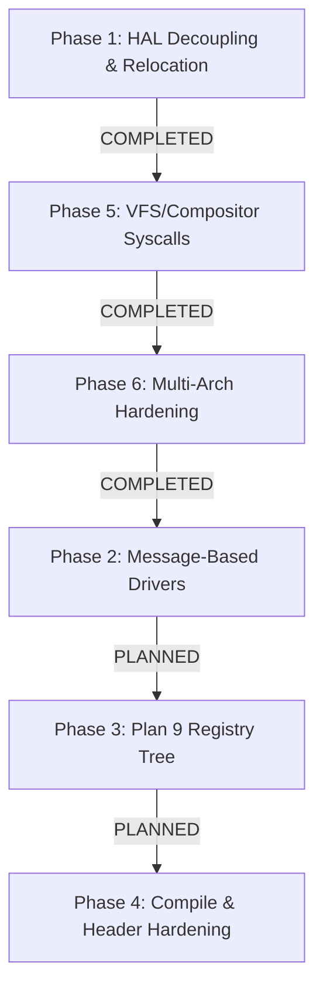

# Refactor Plan: OS1 Microkernel Evolution (GPLv2 Open-Source)

This refactoring plan aligns the **OS1 Microkernel** with standard open-source principles (GPLv2, matching Linux), records all reference inspirations and their direct file locations in the codebase, and blueprints the modular evolution of the microkernel phase by phase.

---

## ⚖️ License & Open-Source Alignment
OS1 is licensed under the **GNU General Public License, Version 2 (GPLv2)**. This licensing choice ensures full alignment with the open-source spirit of **Linux**, promoting collaborative, transparent, and robust operating system development.

### 🌟 Architectural Reference & Inspirations
The dual-architecture microkernel of OS1 is developed by combining proven patterns from established historical operating systems. Plan 9 and seL4 represent our core pillars of design, followed by Linux and BSD models. Below is the prioritizing of our inspirations:

1.  **Plan 9 from Bell Labs (Primary Pillars)**:
    *   *Inspiration*: "Everything is a file/resource" philosophy, hierarchical dynamically mounted key-value trees, and native ring buffers for IPC synchronization.
    *   *File/Code Reference*: The hierarchical dynamic registry keys and ring-buffer serialization mapped in [registry.c](file:///Users/olmo/Documents/git/ostest1/os1test-dev/kernel/libkernel/src/registry.c). Plan 9 style system call wrappers (`rfork`, `pread`, `pwrite`, `await`) planned in user libraries.
2.  **seL4 (Secure Embedded L4 - Primary Pillars)**:
    *   *Inspiration*: Strictly thinned Hardware Abstraction Layer (HAL) focused solely on assembly context setups, exception routing, and MMU directory table loads.
    *   *File/Code Reference*: Assembly entry boundaries in [exception.S](file:///Users/olmo/Documents/git/ostest1/os1test-dev/kernel/hal/arch/aarch64/cpu/exception.S) (AArch64) and [start.S](file:///Users/olmo/Documents/git/ostest1/os1test-dev/kernel/hal/arch/amd64/boot/start.S) (AMD64), context state mapping in `pt_regs`.
3.  **Linux (Kernel)**:
    *   *Inspiration*: Intrusive circular double-linked list structures, K&R style code conventions, and robust Ext4 file traversal logic.
    *   *File/Code Reference*: Double-linked list utility in [list.h](file:///Users/olmo/Documents/git/ostest1/os1test-dev/kernel/core/include/core/list.h), storage block parsing in [ext4.c](file:///Users/olmo/Documents/git/ostest1/os1test-dev/kernel/core/src/fs/ext4.c) and partition structures in [gpt.c](file:///Users/olmo/Documents/git/ostest1/os1test-dev/kernel/core/src/fs/gpt.c).
4.  **base-nexs Project**:
    *   *Inspiration*: Unified system service mapping paradigms and registry loop protocols.
    *   *File/Code Reference*: Architecture registry logic under [registry.c](file:///Users/olmo/Documents/git/ostest1/os1test-dev/kernel/libkernel/src/registry.c) and dynamic service coordination.
5.  **BSD / FreeBSD (VFS Layer)**:
    *   *Inspiration*: BSD-style Virtual File System (VFS) mounting mechanism, file node (vnode) virtualization, and path lookup utilities (`namei`, `nameidata`).
    *   *File/Code Reference*: Mount and vnode interface representations planned under resident filesystem management ([vfs.h](file:///Users/olmo/Documents/git/ostest1/os1test-dev/kernel/core/include/core/vfs.h)).
6.  **Mach4 (Mach Microkernel)**:
    *   *Inspiration*: Fully isolated helper servers communicating with the core through port-based IPC pipelines and asynchronous scheduling.
    *   *File/Code Reference*: IPC dispatch and IPC registry message queues (`SYS_REG_IPC_SEND`/`SYS_REG_IPC_RECV`) implemented under [syscall.c](file:///Users/olmo/Documents/git/ostest1/os1test-dev/kernel/core/src/syscall.c).
7.  **Font Rasterization Libraries (stb_truetype & stb_easy_font)**:
    *   *Inspiration*: Standalone, header-only lightweight graphics typography engine by Sean Barrett.
    *   *File/Code Reference*: TTF parsing tools in [stb_truetype.h](file:///Users/olmo/Documents/git/ostest1/os1test-dev/tools/stb_truetype.h) and user fonts output in [stb_easy_font.h](file:///Users/olmo/Documents/git/ostest1/os1test-dev/user/sys/include/stb_easy_font.h).
8.  **DoomGeneric Engine**:
    *   *Inspiration*: Standardized framework for quick application and game porting on customized embedded framebuffers.
    *   *File/Code Reference*: Custom blitter pipelines and input handlers integrated within user graphic applications.
9.  **Limine Bootloader**:
    *   *Inspiration*: Bootloader stage configurations and boot tags passing, ELF segments unpacking boundaries.
    *   *File/Code Reference*: Multi-stage assembly setups and stage loaders inside [kernel/hal/boot/](file:///Users/olmo/Documents/git/ostest1/os1test-dev/kernel/hal/boot/).

---

## 📅 Refactoring Plan: Phase by Phase



### 🟢 Phase 1: HAL Decoupling, Relocation, and Thinning
*   **Status**: `[x] COMPLETED`
*   **Goal**: Establish a strictly minimal HAL, relocating hardware-specific setup and boot assembly out of the repository root, and removing redundant duplication.
*   **Key Operations**:
    1.  Relocated startup stage loaders to [kernel/hal/boot/](file:///Users/olmo/Documents/git/ostest1/os1test-dev/kernel/hal/boot/).
    2.  Relocated user system startups and platform boundaries to [kernel/hal/user/](file:///Users/olmo/Documents/git/ostest1/os1test-dev/kernel/hal/user/).
    3.  Removed untracked duplicate assembly file `user/sys/lib/syscall.S`.
    4.  Thinned `kernel/hal/arch/` of general paging calculations and unified memory mappings, centralizing them in [kernel/core/src/](file:///Users/olmo/Documents/git/ostest1/os1test-dev/kernel/core/src/).

### 🟢 Phase 5: Unified Resident VFS, Compositor, and System Call Multiplexing
*   **Status**: `[x] COMPLETED`
*   **Goal**: Maintain graphics rendering compositor and Ext4 block-parsing filesystems as high-performance microkernel-resident subsystems, securing them with unified system call boundaries.
*   **Key Operations**:
    1.  Fully restored graphics [compositor.c](file:///Users/olmo/Documents/git/ostest1/os1test-dev/kernel/core/src/graphics/compositor.c) and resident block storage routines under [kernel/core/src/](file:///Users/olmo/Documents/git/ostest1/os1test-dev/kernel/core/src/).
    2.  Muxed and stabilized all 30+ syscalls in [syscall.c](file:///Users/olmo/Documents/git/ostest1/os1test-dev/kernel/core/src/syscall.c), successfully launching isolated user ELFs inside independent page directories.

### 🟢 Phase 6: Multi-Architecture Boot Verification & Platform Hardening
*   **Status**: `[x] COMPLETED`
*   **Goal**: Solve booting locks and triple faults on AArch64 and AMD64 targets and ensure support for hybrid installation media.
*   **Key Operations**:
    1.  **AMD64 GDT Precedence**: Resequenced `cpu_init()` in [cpu.c](file:///Users/olmo/Documents/git/ostest1/os1test-dev/kernel/hal/arch/amd64/cpu/cpu.c) to load the Global Descriptor Table before activating interrupt exception traps, curing SeaBIOS loops.
    2.  **MBR Partition Table Fallback**: Added a robust Master Boot Record partition scanning fallback in [boot_fs.c](file:///Users/olmo/Documents/git/ostest1/os1test-dev/kernel/core/src/boot_fs.c) to ensure hybrid CD-ROM ISO files mount Ext4 partitions flawlessly.

---

### 🟡 Phase 2: Driver Decoupling & Message-Based MMIO/PCI Abstraction
*   **Status**: `[ ] PLANNED`
*   **Goal**: Decouple hardware drivers in [kernel/hal/drivers/](file:///Users/olmo/Documents/git/ostest1/os1test-dev/kernel/hal/drivers/) from direct kernel-space function imports. Group drivers under explicit connection buses, interfacing them via message-based control blocks.
*   **Execution Blueprint**:
    1.  **Structural Grouping**:
        *   Relocate MMIO controllers (PL011, 16550, GIC, PIC timers) to `kernel/hal/drivers/mmio/`.
        *   Relocate PCI-attached devices (VirtIO Block, GPU, Input, PCI bus driver) to `kernel/hal/drivers/pci/`.
    2.  **IPC Control Ports**:
        *   Drivers no longer export public C helper APIs. Instead, they register an IPC queue port within the dynamic registry.
        *   Implement `kernel_driver_send_message()` passing structured hardware control blocks (e.g., `PCI_BUS_PROBE`, `PCI_READ_CONFIG`, `MMIO_WRITE_REG`).

### 🟡 Phase 3: Plan 9 + seL4 Style Hierarchical Registry System
*   **Status**: `[ ] PLANNED`
*   **Goal**: transition resource registration from static arrays to a rich, dynamic tree structure mapped to user-space `/sys/registry`, banning all hardcoded memory parameters from C code.
*   **Execution Blueprint**:
    1.  **Registry Tree Setup**: Build dynamic recursive tree nodes utilizing `RegKey` and `RegIpcQueue` descriptors.
    2.  **Hardware Autodiscovery**: Parse FDT (AArch64) and Multiboot v2 tags (AMD64) at boot, populate `/sys/registry/hardware/` dynamically with IRQs and MMIO physical address frames.
    3.  **VFS Mounting**: Mount the registry tree onto the resident VFS to expose nodes as standard virtual files:
        ```c
        int fd = open("/sys/registry/hardware/uart/baud_rate", O_WRONLY);
        write(fd, "115200", 6);
        close(fd);
        ```

### 🟡 Phase 4: Header Synchronization & Cleaning
*   **Status**: `[ ] PLANNED`
*   **Goal**: Eradicate standard user library overlaps, establish strict compilation boundaries, and protect kernel memory mapping from namespace leakage.
*   **Execution Blueprint**:
    1.  **Standard Segregation**: Audit userland includes in [user/sys/include/](file:///Users/olmo/Documents/git/ostest1/os1test-dev/user/sys/include/). Ensure `user/sys/include/elf.h` is strictly decoupled from the microkernel's segment loader under `kernel/core/include/core/elf.h`.
    2.  **Namespace Audits**: Configure compilation flags to ensure that [kernel/core/](file:///Users/olmo/Documents/git/ostest1/os1test-dev/kernel/core/) and [kernel/hal/](file:///Users/olmo/Documents/git/ostest1/os1test-dev/kernel/hal/) compile exclusively using `libkernel` utility definitions and never pull in userland headers.
