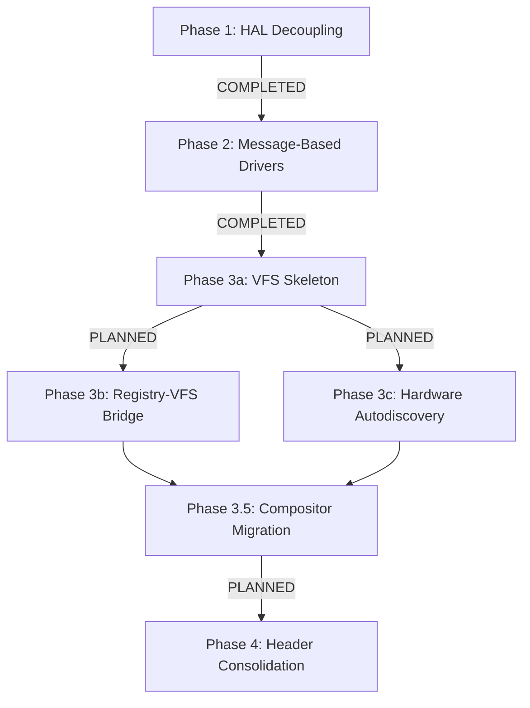
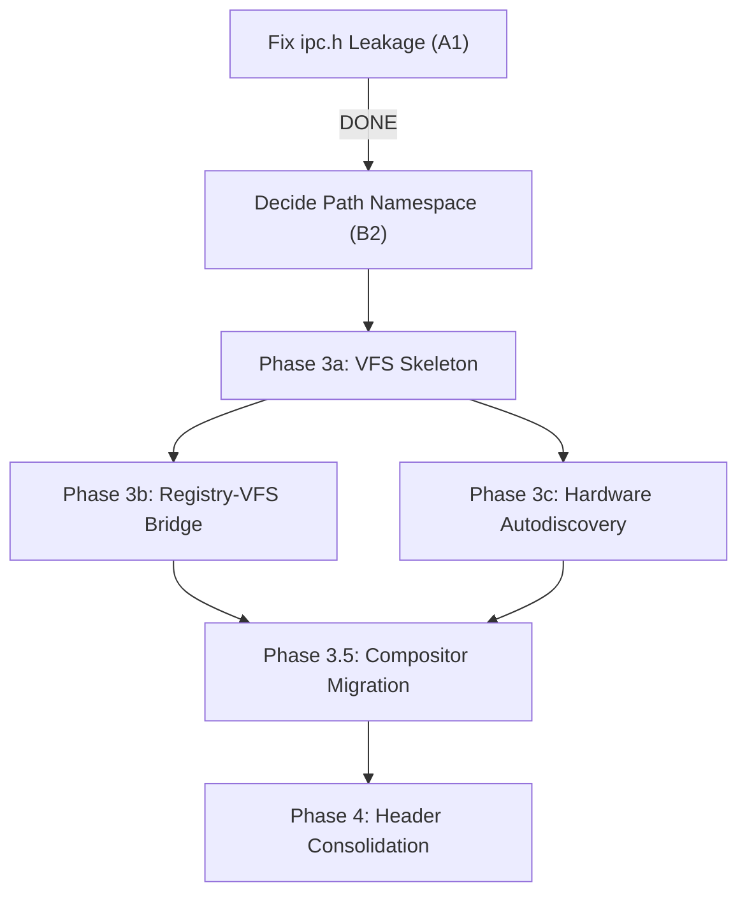

# Refactor Plan: OS1 Microkernel Evolution (GPLv2 Open-Source)

This refactoring plan aligns the **OS1 Microkernel** with standard open-source principles (GPLv2, matching Linux), records all reference inspirations and their direct file locations in the codebase, and blueprints the modular evolution of the microkernel phase by phase.

---

## ⚖️ License & Open-Source Alignment
OS1 is licensed under the **GNU General Public License, Version 2 (GPLv2)**. This licensing choice ensures full alignment with the open-source spirit of **Linux**, promoting collaborative, transparent, and robust operating system development.

### 🌟 Architectural Reference & Inspirations
The dual-architecture microkernel of OS1 is developed by combining proven patterns from established historical operating systems. Plan 9 and seL4 represent our core pillars of design, followed by Linux and BSD models. Below is the prioritizing of our inspirations:

1.  **Plan 9 from Bell Labs (Primary Pillars)**:
    *   *Inspiration*: "Everything is a file/resource" philosophy, hierarchical dynamically mounted key-value trees, and native ring buffers for IPC synchronization.
    *   *File/Code Reference*: The hierarchical dynamic registry keys and ring-buffer serialization mapped in [registry.c](kernel/libkernel/src/registry.c). Plan 9 style system call wrappers (`rfork`, `pread`, `pwrite`, `await`) planned in user libraries.
2.  **seL4 (Secure Embedded L4 - Primary Pillars)**:
    *   *Inspiration*: Strictly thinned Hardware Abstraction Layer (HAL) focused solely on assembly context setups, exception routing, and MMU directory table loads.
    *   *File/Code Reference*: Assembly entry boundaries in [exception.S](kernel/hal/arch/aarch64/cpu/exception.S) (AArch64) and [start.S](kernel/hal/arch/amd64/boot/start.S) (AMD64), context state mapping in `pt_regs`.
3.  **Linux (Kernel)**:
    *   *Inspiration*: Intrusive circular double-linked list structures, K&R style code conventions, and robust Ext4 file traversal logic.
    *   *File/Code Reference*: Double-linked list utility in [list.h](kernel/core/include/core/list.h), storage block parsing in [ext4.c](kernel/core/src/fs/ext4.c) and partition structures in [gpt.c](kernel/core/src/fs/gpt.c).
4.  **base-nexs Project**:
    *   *Inspiration*: Unified system service mapping paradigms and registry loop protocols.
    *   *File/Code Reference*: Architecture registry logic under [registry.c](kernel/libkernel/src/registry.c) and dynamic service coordination.
5.  **BSD / FreeBSD (VFS Layer)**:
    *   *Inspiration*: BSD-style Virtual File System (VFS) mounting mechanism, file node (vnode) virtualization, and path lookup utilities (`namei`, `nameidata`).
    *   *File/Code Reference*: Mount and vnode interface representations planned under resident filesystem management ([vfs.h](kernel/core/include/core/vfs.h)).
6.  **Mach4 (Mach Microkernel)**:
    *   *Inspiration*: Fully isolated helper servers communicating with the core through port-based IPC pipelines and asynchronous scheduling.
    *   *File/Code Reference*: IPC dispatch and IPC registry message queues (`SYS_REG_IPC_SEND`/`SYS_REG_IPC_RECV`) implemented under [syscall.c](kernel/core/src/syscall.c).
7.  **Font Rasterization Libraries (stb_truetype & stb_easy_font)**:
    *   *Inspiration*: Standalone, header-only lightweight graphics typography engine by Sean Barrett.
    *   *File/Code Reference*: TTF parsing tools in [stb_truetype.h](tools/stb_truetype.h) and user fonts output in [stb_easy_font.h](user/sys/include/stb_easy_font.h).
8.  **Limine Bootloader**:
    *   *Inspiration*: Bootloader stage configurations and boot tags passing, ELF segments unpacking boundaries.
    *   *File/Code Reference*: Multi-stage assembly setups and stage loaders inside [kernel/hal/boot/](kernel/hal/boot/).

---

## 📅 Refactoring Plan: Phase by Phase



### 🟢 Phase 1: HAL Decoupling, Relocation, and Thinning
*   **Status**: `[x] COMPLETED`
*   **Goal**: Establish a strictly minimal HAL, relocating hardware-specific setup and boot assembly out of the repository root, and removing redundant duplication.
*   **Key Operations**:
    1.  Relocated startup stage loaders to [kernel/hal/boot/](kernel/hal/boot/).
    2.  Relocated user system startups and platform boundaries to [kernel/hal/user/](kernel/hal/user/).
    3.  Removed untracked duplicate assembly file `user/sys/lib/syscall.S`.
    4.  Thinned `kernel/hal/arch/` of general paging calculations and unified memory mappings, centralizing them in [kernel/core/src/](kernel/core/src/).

### 🟢 Phase 2: Driver Decoupling & Message-Based MMIO/PCI Abstraction
*   **Status**: `[x] COMPLETED`
*   **Goal**: Decouple hardware drivers in [kernel/hal/drivers/](kernel/hal/drivers/) from direct kernel-space function imports. Group drivers under explicit connection buses, interfacing them via message-based control blocks.
*   **Key Operations**:
    1.  **Structural Grouping**: Relocated drivers to physical subfolders `mmio/` and `pci/` under [kernel/hal/drivers/](kernel/hal/drivers/) based on interface type.
    2.  **Message-Based Interfaces**: Implemented `struct hw_driver` messaging protocol and dispatch queues in [drivers.h](kernel/core/include/core/drivers.h) and [drivers.c](kernel/core/src/drivers.c).
    3.  **Driver Port Refactoring**: Shifted UART (PL011/16550) and VirtIO-Block to register under the message dispatcher, resolving driver access through port-based IPC message queues rather than direct C function binding.

### 🟡 Phase 3a: VFS Skeleton (Prerequisite)
*   **Status**: `[ ] PLANNED`
*   **Goal**: Build the minimum VFS infrastructure required before the registry can be mounted as a pseudo-filesystem. Currently, all VFS syscalls return `-ENOSYS` (see `stubs.c`) and `vfs.h` contains only one prototype (`vfs_resolve_path`).
*   **Execution Blueprint**:
    1.  **Per-Process FD Table**: Implement `struct file *fd_table[]` in the process structure, with fd 0/1/2 pre-wired to the console.
    2.  **VFS Interfaces**: Define `struct vfsops` and `struct vnodeops` interface stubs in [vfs.h](kernel/core/include/core/vfs.h).
    3.  **Mount Table**: Implement `vfs_mount_table[]` with the boot Ext4 filesystem as the initial entry.
    4.  **Syscall Routing**: Implement `sys_open/read/write/close` routing through the vnode layer, replacing the current `-ENOSYS` stubs.

### 🟡 Phase 3b: Plan 9 + seL4 Style Registry-VFS Bridge
*   **Status**: `[ ] PLANNED`
*   **Depends On**: Phase 3a completed.
*   **Goal**: Mount the dynamic registry into the VFS as a pseudo-filesystem at `/sys/registry`, allowing high-level services to query drivers via standard file descriptors.
*   **Execution Blueprint**:
    1.  **Registry VFS Ops**: Implement `reg_vfs_open/read/write/readdir` that translate fd operations into `registry_get/registry_set/registry_list` calls.
    2.  **Pseudo-FS Registration**: Register the registry as a pseudo-filesystem type in the mount table at `/sys/registry`.
    3.  **Verification**: Test with actual registry paths:
        ```c
        int fd = open("/sys/registry/drivers/uart/type", O_RDONLY);
        char buf[128];
        read(fd, buf, sizeof(buf)); // buf = "PL011" or "16550"
        close(fd);
        ```

### 🟡 Phase 3c: Hardware Autodiscovery
*   **Status**: `[ ] PLANNED`
*   **Can Parallel**: With Phase 3b once Phase 3a is done.
*   **Goal**: Parse FDT (AArch64) and Multiboot v2 tags (AMD64) at boot to dynamically populate hardware metadata in the registry.
*   **Execution Blueprint**:
    1.  **AMD64 Multiboot2 Walker**: Implement tag parser in `kernel_main()` to extract memory map and ACPI/RSDP pointer (currently `mbi_ptr` is discarded with `(void)mbi_ptr`).
    2.  **Post-Registry Population**: Call FDT/Multiboot2 parsing *after* `registry_init()` and populate `hardware/<device>/base_address` and `hardware/<device>/irq` from parsed data.
    3.  **AArch64 FDT Reordering**: Move FDT-based hardware population to occur after registry initialization (currently `fdt_init()` runs before `registry_init()`).

### ⚠️ Phase 3.5: Compositor User-Space Migration
*   **Status**: `[ ] PLANNED`
*   **Goal**: Migrate the kernel-resident graphics compositor from [compositor.c](kernel/core/src/graphics/compositor.c) to a user-space daemon. Currently 10 compositor syscalls (`SYS_CREATE_WINDOW`, `SYS_WINDOW_BLIT`, `SYS_COMPOSITOR_RENDER`, etc.) are dispatched directly in [syscall.c](kernel/core/src/syscall.c).
*   **Execution Blueprint**:
    1.  Create a user-space compositor daemon (`user/sys/bin/compositor.c`).
    2.  Replace direct compositor syscalls with IPC messages to the compositor daemon.
    3.  Implement shared memory buffer mapping for framebuffer blitting.
    4.  Remove compositor code from kernel-space.

### 🟡 Phase 4: Header Synchronization & Cleaning
*   **Status**: `[ ] PARTIALLY COMPLETED`
*   **Goal**: Eradicate standard user library overlaps, establish strict compilation boundaries, and protect kernel memory mapping from namespace leakage.
*   **Execution Blueprint**:
    1.  `[x]` **DONE** — Standard Segregation: `user/sys/include/elf.h` is strictly decoupled from `kernel/core/include/core/elf.h`. Both headers exist independently.
    2.  `[x]` **DONE** — Full namespace isolation: Created kernel-private headers for `ipc_types.h`, `abi.h`, `font.h`, `errno.h`. Removed `-Iuser/sys/include` from kernel CFLAGS. Makefile now uses `KERNEL_INCLUDE` and `USER_INCLUDE` separately.
    3.  `[ ]` **Remaining** — Namespace Audits: Verify no regression occurs and all shared types (ABI definitions) remain byte-identical between kernel and user copies.

### 🟢 Correct Execution Order for Phase 3


